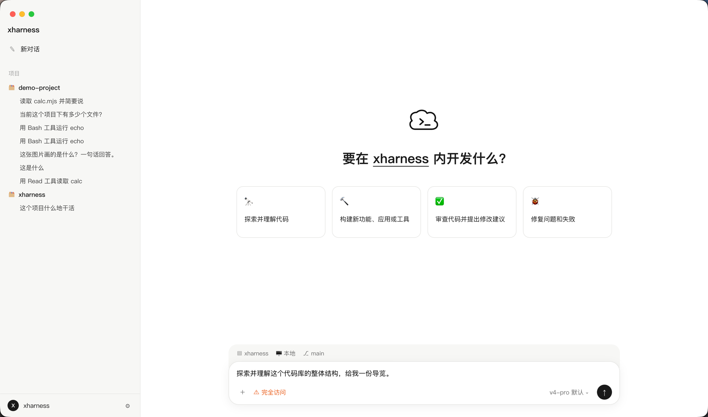

# xharness

<p align="center">
  
</p>

用 TypeScript 实现的 coding agent harness，提供终端 CLI 与 macOS 桌面 GUI 两种形态：模型自主地**读代码 → 改代码 → 跑命令验证**，直到任务完成。走 Anthropic Messages API 格式（`@anthropic-ai/sdk`，流式输出），默认对接 DeepSeek 的 Anthropic 兼容端点，端点与模型完全可配（已内置 DeepSeek / 可添加 Kimi 等任意兼容供应商）。同一响应中的多个工具调用**并行执行**，结果按序回填。

## 安装

前置依赖：

- **Node.js >= 22**（Glob 工具依赖 Node 22 的 `fs.glob`）
- **ripgrep（`rg`）为硬依赖**：Grep 工具封装 `rg`，无 JS 回退。启动时检测，缺失则直接报错退出。

```bash
brew install ripgrep      # macOS；其他平台见 ripgrep 官方安装说明
```

安装与构建：

```bash
npm install
npm run build
npm link                  # 可选：得到全局 xharness 命令
```

## 配置

全部配置通过环境变量读取：

| 环境变量 | 必填 | 默认值 | 说明 |
|---|---|---|---|
| `ANTHROPIC_API_KEY` | 是 | 无（缺失启动报错） | API key。默认端点是 DeepSeek，填 DeepSeek key 即可 |
| `ANTHROPIC_BASE_URL` | 否 | `https://api.deepseek.com/anthropic` | 可覆盖为官方 Anthropic 或其他 Anthropic 兼容端点 |
| `XHARNESS_MODEL` | 否 | `deepseek-v4-pro` | 模型 ID，如 `deepseek-v4-flash`、claude 系列 |
| `XHARNESS_CONTEXT_WINDOW` | 否 | 内置模型表 | 上下文窗口 token 数（正整数）。内置表：`deepseek-v4-*` 为 1M，未知模型默认 200K |
| `XHARNESS_EFFORT` | 否 | 未设置（= 端点默认 `high`） | thinking 档位：`none` / `low` / `high` / `max`，见下文 Thinking 章节 |

示例：

```bash
export ANTHROPIC_API_KEY=<你的 DeepSeek key>
xharness
```

## 使用

### 启动方式

```bash
xharness                    # 交互 REPL
xharness -p "读 package.json 并告诉我依赖"   # 一次性模式（执行完退出）
xharness --version          # 打印版本
```

### 交互按键

- **Ctrl+C**：中断当前进行中的回合（终止 API 流与运行中的 Bash 子进程），不退出程序
- **Ctrl+D** 或 `/exit`：退出

### 斜杠命令

| 命令 | 作用 |
|---|---|
| `/help` | 列出内置命令与已加载的技能 |
| `/clear` | 清空会话历史与任务清单 |
| `/compact` | 手动压缩会话历史 |
| `/effort [档位]` | 查看或切换 thinking 档位（none/low/high/max），见下文 Thinking 章节 |
| `/exit` | 退出 |
| `/<技能名> [参数]` | 触发同名技能（见下节）。内置命令优先级高于同名技能 |

### 项目指令文件

启动时读取当前目录下的 `AGENTS.md` 注入系统提示；不存在则回退读取 `CLAUDE.md`；都不存在则跳过。

## Thinking 思考档位

对接 DeepSeek Anthropic 端点的 Thinking Mode：`low/high/max` 档请求携带 `"reasoning": {"effort": "<档位>"}`，`none` 档携带 `"thinking": {"type": "disabled"}`（见下文实测注）。模型的思考内容以**暗色（ANSI dim）**流式打印在正文之前，与正文之间以空行分隔。思考内容只做展示，**不进入会话历史**。

四档（不多不少）：

| 档位 | 含义 |
|---|---|
| `none` | 关闭思考，直接作答 |
| `low` | 低强度思考 |
| `high` | 高强度思考（**端点默认**：不传参数时即此档） |
| `max` | 最大强度思考 |

设置方式：

- **启动默认**：环境变量 `XHARNESS_EFFORT`（非法值启动报错并列出四档）；不设置则不携带 `reasoning` 参数，行为等同端点默认 `high`。
- **会话内切换**：`/effort <档位>`，下一回合生效；`/effort` 无参数打印当前档位与可选值。

注意事项：

- **v4-pro 映射现状**：按 DeepSeek 官方文档，`deepseek-v4-pro` 当前会把 `low` 映射为 `high`（即 pro 上 low 与 high 行为一致）；`deepseek-v4-flash` 四档均有效。
- **实现与实测现状（2026-08-01）**：`none` 档经 Anthropic 官方参数 `thinking: {"type": "disabled"}` 实现（实测可真正关闭思考，不再携带 `reasoning`）；`low/high/max` 按 DeepSeek 官方文档透传 `reasoning.effort`，实测各档思考量差异不显著，端点侧行为以 DeepSeek 上游为准。
- **计费提示**：思考内容同样计入输出 token 计费，`max` 档思考 token 消耗显著增加；对简单任务可用 `none`/`low` 降低延迟与成本。
- `budget_tokens`（Anthropic 官方 thinking 参数）被 DeepSeek 端点忽略，xharness 不实现。

## 技能编写

技能目录结构（两级，项目级覆盖全局同名技能）：

```
~/.agents/skills/<name>/SKILL.md          # 全局（跨 harness 通用目录，可与其他 agent 工具共享技能）
<项目根>/.agents/skills/<name>/SKILL.md   # 项目级，覆盖全局同名
```

`SKILL.md` 使用与 Claude Code 兼容的 frontmatter 格式（`name`、`description`），正文即技能指令体。示例：

```markdown
---
name: greet
description: 生成一个问候文件并读回确认
---

在当前目录创建 greeting.txt，内容为一句友好的问候，
然后用 Read 工具读回并向用户确认内容。
```

说明：

- `description` 必填，缺失或 frontmatter 损坏时打印警告并跳过该技能，不会崩溃；
- `name` 缺失时以目录名兜底；
- 技能有两种触发方式：
  1. **用户触发**：REPL 中输入 `/<name> [参数]`，技能指令体（加可选参数）注入本回合用户消息；
  2. **模型触发**：技能列表（名称+描述）注入系统提示，模型可主动调用 `Skill` 元工具获取技能指令体全文并执行。

## GUI 桌面应用

仓库内含 Electron 图形界面（`gui/`），复用同一引擎，功能包括多项目/多会话管理、
流式渲染、思考折叠、图片附件（含截图粘贴）、技能与斜杠命令、模型供应商设置等：

```bash
cd gui && npm install
npm start          # 需 ANTHROPIC_API_KEY 或 DEEPSEEK_API_KEY
```

⚠️ **GUI 与 CLI 完全相同地运行在 YOLO 无沙箱模式下**（界面上的橙色"完全访问"徽标即此含义），
首次启动会要求确认风险；详见下方风险声明与 `gui/README.md`、`SECURITY.md`。

## YOLO 无沙箱模式 —— 风险声明（务必阅读）

**xharness 只有 YOLO 一种权限模式，有意不做任何运行时防护：**

- 所有工具（含 Bash、Write、Edit）**直接执行，无确认弹窗**；
- **无路径约束**：模型可读写当前目录之外的任意文件（包括 home 目录、系统路径）；
- **无命令黑名单**：模型可执行任意 shell 命令。

也就是说，模型在你的机器上拥有与你的 shell 相同的权力。建议：

- 只在**可信任务**与**非关键目录**中使用；
- 重要项目先提交 git、做好备份；
- 不要在含敏感数据或生产凭证的环境中运行。

**风险自负。**

## 已知限制

- **B1 压缩下限**：上下文压缩保留最近 10 条原始消息。当消息总数 ≤ 10 且其中单条工具输出巨大时，compact 无法压缩，理论上可导致上下文溢出。真实 1M 窗口 + Bash 输出 30K 字符截断的前提下，仅 Read 病态大文件等极端情况可能触达，概率极低。
- **当前版本暂不提供**：子代理/多代理编排、MCP 协议、Hooks/settings.json 配置体系、YOLO 之外的权限确认模式、Plan 模式、持久记忆、OpenAI 等其他 provider 格式、markdown 终端渲染/TUI 框架、运行时沙箱。

## 开发

```bash
npm test              # vitest 单测（API 全 mock，不发真实请求、不耗 token）
npm run test:e2e      # 端到端测试：需要 ANTHROPIC_API_KEY（无 key 时整体 skip），
                      # 统一走 DeepSeek 端点 + deepseek-v4-flash 轻量模型
npx tsc --noEmit      # 类型检查
npm run build         # tsc 编译到 dist/
```
