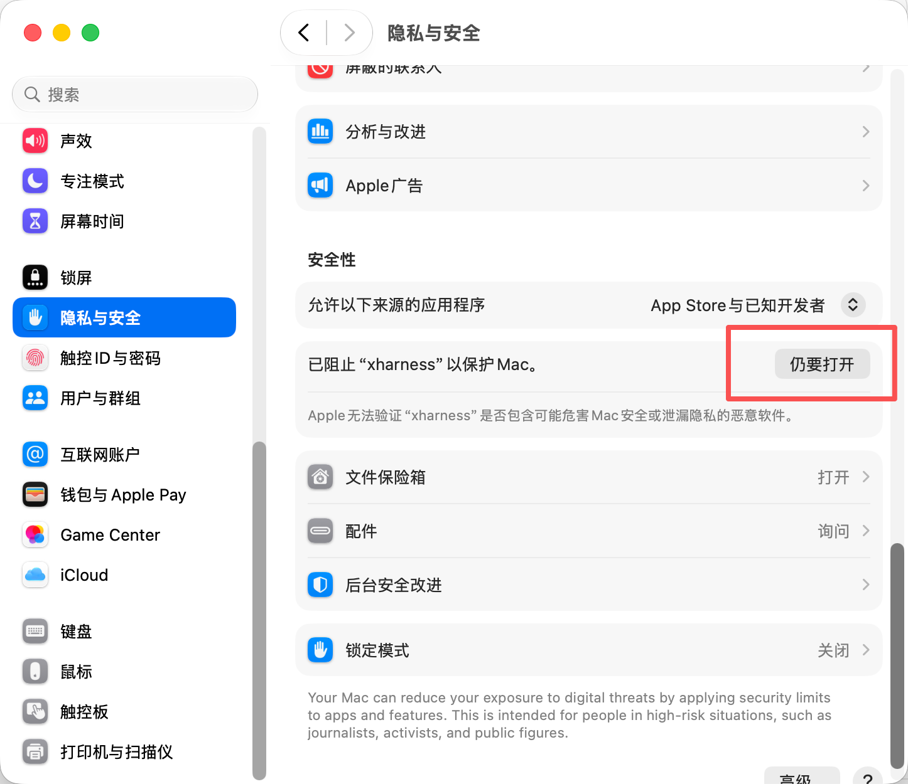

# xharness

<p align="center">
  
</p>

<p align="center">
  <a href="https://github.com/linearuncle/xharness/releases/latest"></a>
  <a href="LICENSE"></a>
  
</p>

**一个装在你电脑上的 AI 编程搭档。** 把项目文件夹丢给它，用聊天的方式布置任务——它会自己读代码、改代码、跑命令验证，一步步做完，整个过程你都看得见。

不是"复制代码再粘贴回编辑器"的问答机器人：它直接在你的项目里动手干活。

## 它能帮你做什么

- 🗺 **看懂陌生项目**——"这个项目是干什么的？给我一份代码导览"
- 🔧 **修 bug**——"test.mjs 跑不过，找到问题修好它，跑到测试通过为止"
- ✨ **写新功能**——"给这个接口加上分页，写好测试"
- 🔍 **审查代码**——"看看这次改动有没有安全问题"
- 🖼 **看图干活**——截图直接 ⌘V 粘贴进对话框，"照着这个设计图写页面"

工作时每一步都实时显示：读了哪个文件、跑了什么命令、在思考什么（可展开看），回答以带代码高亮的富文本呈现。

## 三分钟上手

1. **下载安装**：去 [Releases](https://github.com/linearuncle/xharness/releases/latest) 下载 `xharness-mac-arm64.zip`，解压后把 `xharness.app` 拖进「应用程序」。

   首次打开会被 macOS 拦截（应用没花钱做苹果公证，属正常现象）：先试右键 → 打开；
   如果还是打不开，去 **系统设置 → 隐私与安全性**，在「安全性」一栏找到被阻止的
   xharness，点 **「仍要打开」**：

   <p align="center"></p>
2. **填一个 API Key**：点左下角 ⚙ 进设置。内置了 DeepSeek（去 [platform.deepseek.com](https://platform.deepseek.com) 注册拿 key，很便宜），填入保存即可。用 Kimi 或其他服务见下文。
3. **开始干活**：点侧栏「项目」旁的 ＋（或 ⌘O）选择你的代码文件夹 → ⌘N 新建对话 → 说出你要做的事。

> 首次启动会有一个风险确认——请认真读完再勾选，见下方「必须了解的风险」。

## 日常使用

| 操作 | 怎么做 |
|---|---|
| 新建对话 / 添加项目 | ⌘N / ⌘O，或点侧栏按钮 |
| 换模型、调思考深度 | 输入框右下角 `v4-flash 高 ▾`——模型按服务商分组；思考深度四档（关闭/低/高/Max），越高越会琢磨、也越费 token |
| 发图片 | 截图后直接 ⌘V 粘贴，或点 ＋ →「添加附件」（需要支持视觉的模型，如 Kimi k3） |
| 引用项目文件 | 输入 `@` 模糊搜索文件名，选中即插入路径 |
| 技能（预设指令） | 输入 `/` 弹出可用技能列表；`/compact` 压缩长对话、`/clear` 清空当前对话 |
| 中途叫停 | 点发送按钮位置的 ■ |
| 会话里模型提问 | 它有拿不准的会弹选项卡问你，点选或直接打字回答 |

**技能**是可复用的指令模板，放在 `~/.agents/skills/<名字>/SKILL.md`（全局）或项目内
`.agents/skills/`（项目级，覆盖全局同名）。这个目录是多家 AI 工具的通用约定——你为别的
工具写过的技能，这里直接能用。文件格式：

```markdown
---
name: greet
description: 生成一个问候文件并读回确认
---

在当前目录创建 greeting.txt，内容为一句友好的问候，然后读回向用户确认。
```

另外，项目根目录若有 `AGENTS.md`（或 `CLAUDE.md`），会作为项目说明自动注入——写清楚
项目约定，它干活会更靠谱。

## 接入模型服务

xharness 走 Anthropic Messages API **格式**，所以任何提供 Anthropic 兼容端点的服务都能接：

| 服务 | Base URL | 模型示例 | 说明 |
|---|---|---|---|
| **DeepSeek**（内置） | `https://api.deepseek.com/anthropic` | `deepseek-v4-flash`（默认）、`deepseek-v4-pro` | 便宜量大，flash 日常够用，pro 更强 |
| Kimi | `https://api.kimi.com/coding` | `k3` | 1M 上下文、支持看图 |
| Anthropic 官方 | `https://api.anthropic.com` | claude 系列 | |

设置 → 添加供应商，填名称 / Base URL / API Key，再添加模型 ID 与上下文窗口即可。
所有已启用供应商的模型都会出现在聊天窗口的模型菜单里，随时切换。

## 你的数据放在哪

全部在本地，没有任何云端同步：

- 会话记录、项目列表、附件图片：`~/Library/Application Support/xharness/`（逐条追加的
  JSONL 文件，程序崩溃也不会损坏历史）
- API Key：同目录 `settings.jsonl`，文件权限 600（同机其他用户读不了）。**注意是明文
  保存**——这是为了避免 macOS 钥匙串反复弹授权框的取舍，介意的话请勿在共用电脑上填 key

## ⚠️ 必须了解的风险

xharness 只有一种工作模式：**完全访问**（界面上的橙色徽标）。意思是——

**AI 要读写文件、要跑命令，就直接执行了，不会先问你。** 没有沙箱、没有目录限制、
没有命令黑名单。它在你机器上的权力和你打开终端一样大。

所以：

- ✅ 用在有 git 管理的项目上（改坏了随时回退）
- ✅ 布置清晰、范围明确的任务
- ❌ 不要指向存着重要资料又没备份的目录
- ❌ 不要在有生产环境凭证的机器上跑来路不明的任务

详细威胁模型见 [SECURITY.md](SECURITY.md)。**风险自负。**

## 命令行版

同一个引擎也能在终端里跑（适合脚本化 / SSH 场景）：

```bash
# 需要 Node >= 22 与 ripgrep（brew install ripgrep）
npm install && npm run build && npm link

export ANTHROPIC_API_KEY=<你的 DeepSeek key>
xharness                          # 交互式对话
xharness -p "读 package.json 告诉我依赖"   # 单次执行完就退出
```

CLI 通过环境变量配置（`ANTHROPIC_BASE_URL` 换端点、`XHARNESS_MODEL` 换模型、
`XHARNESS_EFFORT` 调思考档位），斜杠命令与技能和 GUI 一致。

## 已知限制

- 目前只发布 macOS Apple Silicon 包；其他平台可自行从源码跑 CLI
- ad-hoc 签名（没交苹果年费），首次打开需按上文「三分钟上手」的方式放行
- 重新打开旧会话时，AI 只记得对话文本，不会回放当时每一步工具细节
- 暂无：MCP、子代理、OpenAI 接口格式的服务

## 参与开发

```bash
npm test                              # 143 个单测，全 mock 不耗 token
npm run test:e2e                      # 端到端（需 key，走 DeepSeek flash）
cd gui && npm start                   # 源码方式跑 GUI
cd gui && node scripts/package-app.mjs   # 打包 .app 与分发 zip
```

架构说明与协作约定见 [CLAUDE.md](CLAUDE.md)（也是给 AI 编程工具看的），产品规格与
历次设计决策见 [GOAL.md](GOAL.md)。欢迎 Issue / PR。

## License

[MIT](LICENSE)
